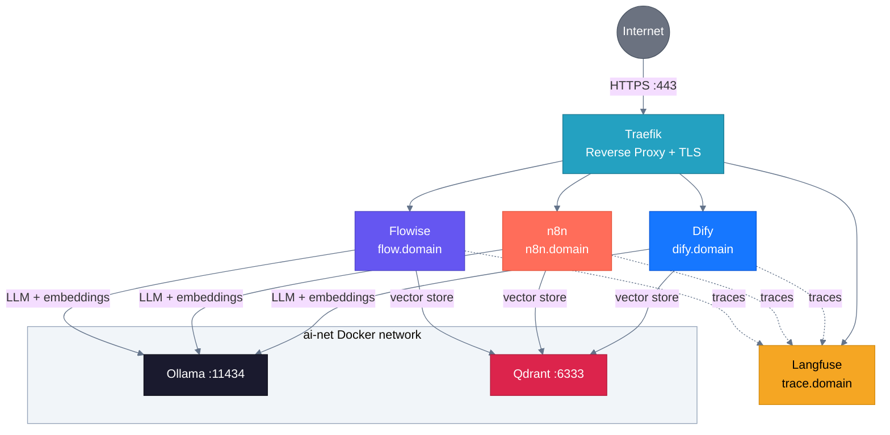

# Integration Guide — Using Services Together

All services in the AI Lab stack share the Docker network `ai-net` and can
connect to each other using their container names. This guide shows how
to wire them together.

## Service Connection Map



## Internal Connection Reference

All services on the `ai-net` Docker network use container names as hostnames.

| Service | Internal URL | Protocol | Auth |
|---------|-------------|----------|------|
| Ollama | `http://ollama-compose:11434` | HTTP / OpenAI-compatible | None |
| Qdrant | `http://qdrant-compose:6333` | HTTP REST | `QDRANT_API_KEY` from `.env` |
| Langfuse | `https://trace.<domain>` | HTTPS | API key (Public + Secret) |
| n8n | `https://n8n.<domain>` | HTTPS | Account credentials |
| Dify | `https://dify.<domain>` | HTTPS | Account credentials |
| Flowise | `https://flow.<domain>` | HTTPS | `FLOWISE_USERNAME` / `FLOWISE_PASSWORD` |

> **Note:** Ollama installed natively (by `setup.sh`) is reachable at
> `http://host.docker.internal:11434` from inside Docker containers.
> When Ollama runs in Docker Compose, use `http://ollama-compose:11434`.

## Integration Matrix

Which service can connect to which, and what for:

| From → To | Ollama | Qdrant | Langfuse | n8n | Dify | Flowise |
|-----------|--------|--------|----------|-----|------|---------|
| **n8n** | LLM chat, embeddings | Vector store (RAG) | Tracing (via HTTP) | — | Trigger workflows | — |
| **Dify** | LLM chat, embeddings | Knowledge base storage | Tracing (native) | Call webhooks | — | — |
| **Flowise** | LLM chat, embeddings | Vector store (RAG) | Tracing (via API) | Call webhooks | — | — |
| **Langfuse** | — | — | — | — | — | — |

## Ollama — LLM for All Services

Ollama provides local LLM inference and embeddings to every AI platform.

### Required Models

Pull these models before using integrations:

```bash
# Chat / reasoning model
ollama pull llama3.2

# Embedding model (required for RAG)
ollama pull nomic-embed-text
```

### Connect from n8n

**Option A — AI Agent nodes (recommended):**

1. Add **AI Agent** or **Basic LLM Chain** root node
2. Attach **Ollama Chat Model** sub-node
3. Set Base URL: `http://ollama-compose:11434`
4. Select Model: `llama3.2`

**Option B — HTTP Request node:**

1. Add **HTTP Request** node → POST
2. URL: `http://ollama-compose:11434/v1/chat/completions`
3. Body (JSON):

```json
{
  "model": "llama3.2",
  "messages": [{"role": "user", "content": "Hello"}]
}
```

### Connect from Dify

1. Go to **Settings → Model Providers → Ollama**
2. Add model:
   - Model Name: `llama3.2`
   - Base URL: `http://ollama-compose:11434`
3. For embeddings, add `nomic-embed-text` the same way

> If Ollama is installed natively (not in Docker Compose), use
> `http://host.docker.internal:11434` instead.

### Connect from Flowise

1. Add a **ChatOllama** node
2. Base URL: `http://ollama-compose:11434`
3. Model: `llama3.2`

For embeddings, use the **Ollama Embeddings** node with model `nomic-embed-text`.

## Qdrant — Vector Database for RAG

Qdrant stores embeddings and enables semantic search across all platforms.

### Connect from n8n

1. Go to **Settings → Credentials → Add Credential → Qdrant**
2. API URL: `http://qdrant-compose:6333`
3. API Key: value of `QDRANT_API_KEY` from `.env`

Use the **Qdrant Vector Store** node in AI workflows:

- **Insert mode:** store document embeddings
- **Retrieve mode:** search for similar documents (RAG)

Always attach an **Embeddings** sub-node (Ollama Embeddings, model
`nomic-embed-text`) to the Qdrant Vector Store node.

### Connect from Dify

1. Create a **Knowledge Base**
2. Choose **Qdrant** as vector store:
   - URL: `http://qdrant-compose:6333`
   - API Key: from `.env`
3. Select embedding model (e.g., `nomic-embed-text` via Ollama)
4. Upload and index documents

### Connect from Flowise

1. Add a **Qdrant** vector store node
2. URL: `http://qdrant-compose:6333`
3. API Key: from `.env`
4. Collection Name: your collection

Connect it with **Ollama Embeddings** (`nomic-embed-text`) and a
**Conversational Retrieval QA Chain** for a complete RAG pipeline.

### Important

- Use the **same embedding model** for indexing and retrieval
- `nomic-embed-text` produces 768-dimension vectors
- Collections are created automatically on first insert

## Langfuse — Observability for All AI Services

Langfuse traces LLM calls, measures latency, and tracks token usage.

### Setup (one-time)

1. Open `https://trace.<domain>`, create an account
2. Create a project
3. Go to **Settings → API Keys → Create API Key**
4. Save the **Public Key** (`pk-...`) and **Secret Key** (`sk-...`)

### Connect from n8n

Use the **HTTP Request** node to send traces to the Langfuse API:

1. POST to `https://trace.<domain>/api/public/ingestion`
2. Headers: `Authorization: Basic <base64(publicKey:secretKey)>`
3. Body: Langfuse ingestion format

Or use a **Code** node with the Langfuse SDK for richer tracing.

### Connect from Dify

Dify has native Langfuse integration:

1. Go to **Settings → Monitoring → LLM Ops**
2. Select **Langfuse**
3. Enter:
   - Host: `https://trace.<domain>`
   - Public Key: `pk-...`
   - Secret Key: `sk-...`

All LLM calls in Dify are now automatically traced.

### Connect from Flowise

Flowise supports Langfuse via environment variables. Add to the `flowise`
service in `docker-compose.yml`:

```yaml
environment:
  - LANGFUSE_BASE_URL=https://trace.<domain>
  - LANGFUSE_PUBLIC_KEY=pk-...
  - LANGFUSE_SECRET_KEY=sk-...
```

### Connect from Python

```python
from langfuse.openai import openai

client = openai.OpenAI(
    base_url="http://localhost:11434/v1",
    api_key="unused",
)

# All calls are automatically traced
response = client.chat.completions.create(
    model="llama3.2",
    messages=[{"role": "user", "content": "Hello"}],
)
```

Set environment variables:

```bash
export LANGFUSE_PUBLIC_KEY=pk-...
export LANGFUSE_SECRET_KEY=sk-...
export LANGFUSE_HOST=https://trace.<domain>
```

## Cross-Platform Workflows

### n8n triggers Dify

Call a Dify chatbot from an n8n workflow:

1. In Dify: create an app, go to **API Access**, copy the API key
2. In n8n: add **HTTP Request** node → POST
   - URL: `https://dify.<domain>/v1/chat-messages`
   - Headers: `Authorization: Bearer <dify-api-key>`
   - Body:

```json
{
  "inputs": {},
  "query": "{{ $json.question }}",
  "user": "n8n-workflow"
}
```

### n8n triggers Flowise

Call a Flowise chatflow from an n8n workflow:

1. In Flowise: create a chatflow, get its ID from the URL
2. Create an API key in Flowise **Settings → API Keys**
3. In n8n: add **HTTP Request** node → POST
   - URL: `https://flow.<domain>/api/v1/prediction/<chatflow-id>`
   - Headers: `Authorization: Bearer <flowise-api-key>`
   - Body:

```json
{
  "question": "{{ $json.input }}"
}
```

### Complete RAG Pipeline (n8n + Qdrant + Ollama)

```text
Schedule Trigger → HTTP Request (fetch docs) → Text Splitter
  → Ollama Embeddings (nomic-embed-text) → Qdrant Vector Store (Insert)
```

Then for querying:

```text
Chat Trigger → AI Agent → Vector Store Retriever (Qdrant)
  → Ollama Chat Model (llama3.2) → Response
```

### Complete RAG Pipeline (Dify)

1. Create Knowledge Base → upload documents → auto-indexed in Qdrant
2. Create a Chatbot app → attach Knowledge Base as context
3. Traces appear automatically in Langfuse

### Complete RAG Pipeline (Flowise)

```text
Document Loader → Recursive Text Splitter
  → Ollama Embeddings (nomic-embed-text)
  → Qdrant Vector Store (Insert)
  → ChatOllama (llama3.2)
  → Conversational Retrieval QA Chain
```

## Troubleshooting Connections

| Problem | Cause | Fix |
|---------|-------|-----|
| `ECONNREFUSED` to Ollama | Wrong host | Use `ollama-compose:11434` (compose) or `host.docker.internal:11434` (native) |
| `ECONNREFUSED` to Qdrant | Wrong host | Use `qdrant-compose:6333` |
| `401 Unauthorized` on Qdrant | Missing API key | Add `QDRANT_API_KEY` from `.env` to credential settings |
| Embedding dimension mismatch | Mixed models | Use the same embedding model for insert and search |
| Langfuse traces not appearing | Wrong keys | Verify Public Key and Secret Key, check Langfuse project |
| n8n cannot reach Dify | Network issue | Both must be on `ai-net` and `traefik-public` networks |
